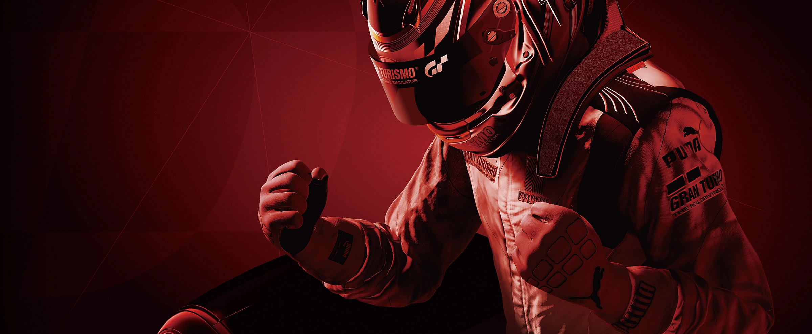

<!--
SPDX-FileCopyrightText: 2026 shadPS4 Emulator Project
SPDX-License-Identifier: GPL-2.0-or-later
-->

<h1 align="center">
  
  <br>
  <b>shadGT</b>
  <br>
  <sub>Gran Turismo Sport on PC, built on the shadPS4 emulator</sub>
</h1>

# About

shadGT is a Windows-only fork of the [shadPS4](https://github.com/shadps4-emu/shadPS4)
PlayStation 4 emulator, focused specifically on **Gran Turismo Sport**.
The tested configuration is **CUSA03220 with update 1.69**. Other games and versions
are outside the project's tested scope.

The goal is accurate graphics, reliable race loading and smoother gameplay while
preserving the game's normal behavior. This is an experimental emulator; performance
and compatibility depend on your hardware, settings and game files.

What shadGT adds on top of shadPS4:

- **Graphics fixes** for GT Sport, including car thumbnails that used to stop the game with
  "BREAK! thumbnail_functions.ad:473".
- **Performance improvements** to GPU command processing, memory tracking and pipeline
  compilation, including workers that prepare pipelines ahead of upcoming draws.
- **A built-in 1.69 boot patch** that addresses a known GT Sport startup crash.
- **Portable user data**: settings, saves, shader caches and logs stay in the `user`
  folder. The packaged launcher keeps its own settings in `launcher`.

Test results and the current baseline are in [GT_SPORT_BASELINE.md](GT_SPORT_BASELINE.md); every
change and its measurements are in [GT_SPORT_OPTIMIZATION_LOG.md](GT_SPORT_OPTIMIZATION_LOG.md).
# Getting started

A portable package contains `shadGT.exe` and `shadGT Launcher.exe`, which is the
shadPS4 Qt launcher configured to use this fork. A source checkout does not include
these compiled applications or the game and firmware files.

Before launching, you need your own GT Sport dump with update 1.69 and the required
PS4 firmware modules. See [Firmware files](#firmware-files) below.

1. Copy your firmware modules into `user\sys_modules` beside `shadGT.exe`.
2. Start `shadGT Launcher.exe` and add the folder that contains your GT Sport game folder
   (`CUSA03220`). Keep the update files available to the emulator; a separate
   `CUSA03220-patch` folder belongs beside the base game folder.
3. Double-click **Gran Turismo Sport** in the game list.

The first visit to a scene may stutter while shaders and pipelines compile. They are
cached in `user\cache` for later runs; subsequent launches may spend time preparing
cached pipelines. Keep that cache unless you are diagnosing a problem.

If launching without the GUI, run the emulator from the folder containing your `user`
directory:

```powershell
.\shadGT.exe "D:\Games\CUSA03220\eboot.bin" --show-fps
```

Replace the example path with your game executable.

# Building

Only Windows builds are supported. Linux, macOS, Docker and Nix build configurations
are not included. CI builds the Windows executable and runs the Windows unit tests.

Install the prerequisites in the [Windows build instructions](documents/building-windows.md):
Visual Studio C++ Build Tools, LLVM (`clang-cl`), CMake and Ninja. Use an x64 developer
shell with LLVM on `PATH`, then run from the repository root:

```powershell
git submodule update --init --recursive
cmake --preset x64-Clang-Release
cmake --build Build/x64-Clang-Release --target shadps4 --parallel 6
```

The resulting executable is `Build\x64-Clang-Release\shadGT.exe`.
The Windows preset enables LibreSSL's Windows endian compatibility path, including
the workaround needed by Clang 23. The internal CMake target is still named `shadps4`;
the application it produces is `shadGT.exe`.

To create a portable package, use `scripts/Make-GTSportPortable.ps1`. It also requires
an unpacked Qt launcher and an existing profile configuration; those local files
are not included in Git. See [Build tools setup](Build/TOOLS_SETUP.md) for the
development and capture tools.

`scripts/Run-GTSportPerformance.ps1` uses an isolated test profile and prints a
performance summary after exit. Supply your own `-GamePath`; the script's default
path is machine-specific. It currently also expects the diagnostic Vulkan SDK
directory to exist. `-DisablePerf <ids>` disables selected optimizations for comparisons.

The recorded GT Sport baseline uses Windows red-zone patching, `readbacks_mode` 1,
linear-image readback and pipeline caching. Fresh emulator profiles do not enable
all of these automatically; preserve the tested settings when packaging a build.

# Keyboard shortcuts

> [!NOTE]
> Some keyboards require holding **Fn** to use the function keys.

| Shortcut | Function |
|-------------|-------------|
F10 | FPS Counter
Ctrl+F10 | Video Debug Info
F11 | Fullscreen
F12 | Trigger RenderDoc Capture (or game-only screenshot if RenderDoc is unavailable)
Alt+F12 | Capture screenshot including HUD/dialog overlays


# Firmware files

Place firmware modules dumped from your PS4 in `user\sys_modules` beside the emulator.
GT Sport uses modules such as `libSceNgs2.sprx` for audio, `libSceJpegDec.sprx` for
image decoding, and `libSceJson2.sprx` and `libSceFont.sprx` for other game services.
These examples are not a complete firmware inventory. Missing modules can cause
missing audio, unavailable features or startup failures.

> [!IMPORTANT]
> The firmware modules and the game must be dumped from your own PlayStation 4 console.

# Credits

shadGT is built on [**shadPS4**](https://github.com/shadps4-emu/shadPS4) and would not exist
without the shadPS4 project and
[**all of its contributors**](https://github.com/shadps4-emu/shadPS4/graphs/contributors). The
emulator core, its libraries and almost all of the code here are their work; shadGT's changes are
listed in [GT_SPORT_OPTIMIZATION_LOG.md](GT_SPORT_OPTIMIZATION_LOG.md). The Qt launcher is the
[shadPS4 Qt launcher](https://github.com/shadps4-emu/shadps4-qtlauncher). The GT Sport 1.69 boot
patch is by Kravickas, from the shadPS4 game patch repository.

shadGT is not affiliated with the shadPS4 project, Sony Interactive Entertainment or Polyphony
Digital. Gran Turismo is a trademark of Sony Interactive Entertainment.

For shadGT-specific problems, report them in this repository's
[issue tracker](https://github.com/mlgprorektm8/shadPS4/issues), rather than the upstream
shadPS4 project. Include your build commit, game version, hardware, settings and a
description of how to reproduce the problem. Logs can contain local paths or account
information, so check them before sharing.

# License

Licensed under [GPL-2.0-or-later](LICENSE), like shadPS4.

<p align="center">
  
</p>
