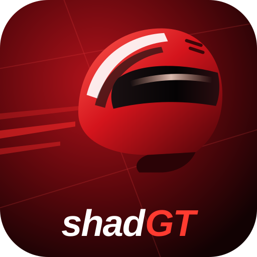

<!--
SPDX-FileCopyrightText: 2026 shadPS4 Emulator Project
SPDX-License-Identifier: GPL-2.0-or-later
-->

<h1 align="center">
  
   
  <b>shadGT</b>
   
  Gran Turismo Sport on PC, built on the shadPS4 emulator
</h1>

# About

shadGT is a fork of the [shadPS4](https://github.com/shadps4-emu/shadPS4) PlayStation 4 emulator
focused on one game: **Gran Turismo Sport** (CUSA03220, update 1.69), on **Windows**. The goal is
for the game to run its normal code paths, render correctly and play smoothly, without graphical
hacks.

What shadGT adds on top of shadPS4:

- **Graphics fixes** for GT Sport, including car thumbnails that used to stop the game with
  "BREAK! thumbnail_functions.ad:473".
- **Faster races**: changes to GPU command processing and memory tracking, and new pipelines
  built ahead of their draws on all CPU cores, so new scenes stall far less.
- **The 1.69 boot patch built in**, so the game starts however it is launched.
- **A portable install**: every setting, save, shader cache and log stays in the folder beside
  the executable, never in AppData.

Test results and the current baseline are in [GT_SPORT_BASELINE.md](GT_SPORT_BASELINE.md); every
change and its measurements are in [GT_SPORT_OPTIMIZATION_LOG.md](GT_SPORT_OPTIMIZATION_LOG.md).

> [!IMPORTANT]
> shadGT is tested with GT Sport only. Other games may run as they do on shadPS4, or not at all.

# Getting started

A shadGT folder (made with `scripts/Make-GTSportPortable.ps1`) contains `shadGT.exe` and
`shadGT Launcher.exe`, the [shadPS4 Qt launcher](https://github.com/shadps4-emu/shadps4-qtlauncher)
set up to run it.

1. Copy the firmware modules listed below from your own PS4 into `user\sys_modules`.
2. Start `shadGT Launcher.exe` and add the folder that contains your GT Sport game folder
   (CUSA03220, dumped from your own console with update 1.69).
3. Double-click Gran Turismo Sport.

The first time a scene is shown its shaders are compiled, so it can stutter briefly; after that
they are cached in `user\cache` and load at startup.

Questions and reports: [shadGT Discord](https://discord.gg/De94trHtj5).

# Building

shadGT builds like shadPS4: see the [Windows build instructions](documents/building-windows.md).
The executable is `shadGT.exe`. `scripts/Run-GTSportPerformance.ps1` runs GT Sport with a test
profile and prints a performance summary; `-DisablePerf <ids>` switches individual changes off
for comparisons.

# Keyboard and Mouse Mappings

> [!NOTE]
> Some keyboards may also require you to hold the Fn key to use the F\* keys. Mac users should use the Command key instead of Control, and need to use Command+F11 for full screen to avoid conflicting with system key bindings.

| Button | Function |
|-------------|-------------|
F10 | FPS Counter
Ctrl+F10 | Video Debug Info
F11 | Fullscreen
F12 | Trigger RenderDoc Capture (or game-only screenshot if RenderDoc is unavailable)
Alt+F12 | Capture screenshot including HUD/dialog overlays

> [!NOTE]
> Xbox and DualShock controllers work out of the box.

| Controller button | Keyboard equivalent |
|-------------|-------------|
LEFT AXIS UP | W |
LEFT AXIS DOWN | S |
LEFT AXIS LEFT | A |
LEFT AXIS RIGHT | D |
RIGHT AXIS UP | I |
RIGHT AXIS DOWN | K |
RIGHT AXIS LEFT | J |
RIGHT AXIS RIGHT | L |
TRIANGLE | Numpad 8 or C |
CIRCLE | Numpad 6 or B |
CROSS | Numpad 2 or N |
SQUARE | Numpad 4 or V |
PAD UP | UP |
PAD DOWN | DOWN |
PAD LEFT | LEFT |
PAD RIGHT | RIGHT |
OPTIONS | RETURN |
BACK BUTTON / TOUCH PAD | SPACE |
L1 | Q |
R1 | U |
L2 | E |
R2 | O |
L3 | X |
R3 | M |

Keyboard and mouse inputs can be customized in the settings menu by clicking the Controller button, and further details and help on controls are  also found there. Custom bindings are saved per-game. Inputs support up to three keys per binding, mouse buttons, mouse movement mapped to joystick input, and more.

# Firmware files

GT Sport needs these PlayStation 4 firmware modules, placed in the `user\sys_modules` folder:

| Modules                        | Modules                        | Modules                        | Modules                        |
|--------------------------------|--------------------------------|--------------------------------|--------------------------------|
| libSceAt9Enc.sprx              | libSceAudiodec.sprx            | libSceAudiodecCpu.sprx         | libSceAudiodecCpuDdp.sprx      |
| libSceAudiodecCpuDtsHdLbr.sprx | libSceAudiodecCpuHevag.sprx    | libSceAudiodecCpuM4aac.sprx    | libSceAvPlayer.sprx            |
| libSceAvPlayerStreaming.sprx   | libSceBeisobmf.sprx            | libSceBemp2sys.sprx            | libSceCesCs.sprx               |
| libSceFont.sprx                | libSceFontFt.sprx              | libSceFreeTypeOl.sprx          | libSceFreeTypeOptOl.sprx       |
| libSceFreeTypeOt.sprx          | libSceJpegDec.sprx             | libSceJpegEnc.sprx             | libSceJson.sprx                |
| libSceJson2.sprx               | libSceLibcInternal.sprx        | libSceNgs2.sprx                | libScePngEnc.sprx              |
| libScePsmKitSystem.sprx        | libSceRtc.sprx                 | libSceRudp.sprx                | libSceSystemGesture.sprx       |
| libSceUlt.sprx                 | libSceWkFontConfig.sprx        | libSceXml.sprx                 | libSceDepth.sprx               |
| libScePadTracker.sprx          | libSceMoveTracker.sprx         |

> [!Caution]
> The firmware modules and the game must be dumped from your own PlayStation 4 console.

# Credits

shadGT is built on [**shadPS4**](https://github.com/shadps4-emu/shadPS4) and would not exist
without the shadPS4 project and
[**all of its contributors**](https://github.com/shadps4-emu/shadPS4/graphs/contributors). The
emulator core, its libraries and almost all of the code here are their work; shadGT's changes are
listed in [GT_SPORT_OPTIMIZATION_LOG.md](GT_SPORT_OPTIMIZATION_LOG.md). The Qt launcher is the
[shadPS4 Qt launcher](https://github.com/shadps4-emu/shadps4-qtlauncher). The GT Sport 1.69 boot
patch is by Kravickas, from the shadPS4 game patch repository.

shadGT is not affiliated with the shadPS4 project, Sony Interactive Entertainment or Polyphony
Digital. Gran Turismo is a trademark of Sony Interactive Entertainment.

# License

- [**GPL-2.0 license**](LICENSE), like shadPS4.
